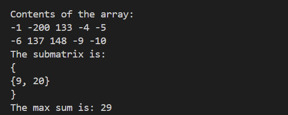

# Brightest_Area_in_Image
Given a text file containing a rectangular matrix representing the pixel values in an image 
(in the range 0 to 255). Designing an algorithm to print the brightest area in the image. 
The definition of the brightest area is a rectangular submatrix of A[][] of maximum sum, 
where A[][] is obtained by subtracting 128 from each pixel value in the original image. 
Also used Kadane's algorithm as a subroutine to find the brightest area.

## OUTPUT:

